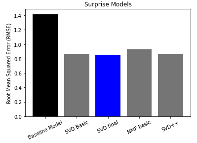

# Netflik Movie Recommendation System
Em Jager and Sam Whitehurst

### Overview
For many streaming services there is an overwhelming amount of content. Customers may search fruitlessly through thousands of titles only to pick a movie they ultimately don't enjoy. When the initial search begins to feel inconvenient to a customer, Netfilk Movie Corp is at risk of losing that client's interest and eventually their business. We designed a predictive algorithm will learn the preferences of each user and build them a profile, which can then be compared to users with similar profiles who have watched and rated some of the same and other similar films. Using the'surprise' package from sklearn with a algorithmic technique called Collaborative Filtering, our system will make recommendations to each user for new, unwatched films based on how highly similar users have rated that film. To maximize convenience, with the customers valuable time in mind, our system is designed to deliever 5 tailor-made recommendations, thus eliminating the need to scroll through endless content to find a film they may enjoy.

### Business Problem
The stakeholders are the new shareholders at the Netflik Movie Corp, as they've invested in this new online streaming service. The streaming service provides a personalized experience for every customer by employing the most advanced algorithms and techniques for recommending only the films that are most likely to interest each user. This system builds profiles for each user and then identifies the particular interestes of each user based on the ratings the user provides (on a scale from 0.5 - 5) for each movie they watch. We theorize that similar user profiles will have similar tastes, therefore if our system recognizes that a customer has not seen a film that similar users have rated highly, then our system will recommend that the user watches that film.

We have distilled the search process from thoousands of titles to 5, which allows the user an efficient way to select a movie they are likely to enjoy. Of course, there is the possibility that the user does not like the film they choose from our system's recommendation list, in which case we highly encourage that user to rate that film fairly (and lower) so our system can better adapt to their taste. Because our system relies so heavily on user ratings for input, we have made the rating process as simple as pushing a button as soon as the user finishes their film - that way we our recommendation system can learn from as much data as possible about a user. To address the cold-issue that accompanies a system like this, upon starting a subscription, we ask that all new users rate popular films that tey have seen, to give our system a jump start on making custom recommendations.

In order to measure the success of our model, we iterated through many options, tuning specifc hyperparameters along the way, until we achieved the lowest RMSE (Root Mean Squared Error). We chose this metric because it is easily interpreted as a value in the same units (within the rating scale) and can be measured for all of the model types that we built. For instance a RMSE of 1.0 would imply that a model consistently predicts a user's rating of an unseen film within 1.0 rating point of the actual rating the user would give the film. The 'surprise' package includes many model options: we established a baseilne RMSE score using the NormalPredictor model which we then compared to model iterations generated using more robust models like Singular Value Decomposition (SVD), NMF, and SVDpp model types. Ultimately, we detemrined that the SVD model with optimized paramters (detailed below) resulted in the lowest RMSE, and therefore is the best model to employ to make our predictions. This model was input into our custom recommendation function which generates a tailored list of 5 film recommendations, none of which should have already been viewed by the user.

### Data Understanding
The data for this project comes from the MovieLens dataset provided by the grouplens website. Specifically, we are working with the smaller dataset available on the website, which contains 4 csv files detailing user ratings for a variety of movies. We worked with two of the csv files for our project: the 'ratings.csv' file and the 'movies.csv' file, but we explored each of the four options first to determine which would be needed for designing our recommendation system. Here is a brief description of each of the files available:

The 'ratings.csv' file contains just over 100,000 user rating records from 610 unique users. This is the primary resource we used when biulding our recommendation system. Among the 610 unique users, there is a wide range of inputs, with the highest total number of s rated reaching 2698 and the lowest being 20. For users with more ratings, our system was better able to recognize preferences, leading to recommendations that are more likely to appeal to the user.

### Modeling
We began the modeling phase of our project by establishing a baseline model that we can later use for comparison when we generate RMSE values for each new model iteration. The baseline model we chose is the NormalPrdictor option from the 'surprise' package and we expect it will not perform too well when modeling the data, as it does not take into account some of the more complex algorithmic functions that the later models employ. We chose three other model types to explore after analyzing our baseline results, they are: the SVD model, an NMF model and finally the SVDpp model. For each model type we attempted to optimize the model's hyperparameters via a GridSearch with cross validation. This allowed us to test many hyperparamter options more efficiently than if we had to instantite and build a totally new model every time we wanted to test a specific set of hyperparameters.

*The only downside to this approach to model optimization, is that grid-searching can be a very slow process to run, which can feel like it is slowing project progress, when it is actually still saving time compared to the manual approach for building each and every unique set of model hyperparameter options. GridSearchCV also has built in methods that allow us to see which parameters are optimal, in other words, which set of parameters generate the lowest RMSE for each model type. For certain model types we chose to run additional grid searches, which we have justified below - All done in hopes of building the best model as indicated by the RMSE score.

We will begin the cross validation process by splitting our data using the train_test_split function specific to the 'surprise' package. Because we do not have a 'target' for this type of model, we do not need to specify a 'y' value, rather we just need to set aside some data so the model can be tested when introduced to 'new' data.

### Baseline Model Placeholder
For the baseline model we used NormalPredictor, a simple baseline algorithm that predicts ratings for items by drawing random values from a normal distribution. We then can compare the RMSE of the NormalPredictor algorithm to our tuned, more sophisticated algorithms, and if our models' RMSE and MAE are lower, we know that the models are performing better than random chance.

Our Baseline Model performed with the following scores:
RMSE: 1.4189
MAE:  1.1326

### SVD: First Complex Model
We chose to then use the Singular Value Decompostion model type to begin our more-complex recommendation system, because an SVD model is categorized as a latent factor model that generates recommendations using specifc user inputs (ratings) tied to specifc items (movies in this case). The SVD model performs matrix factorization without the need for additional setup other than feeding the model a dataset simply consisting of the user identifier (userId), the item identifier (movieId), and the user rating input (rating). Using several iterations of GridSearchCV, we tuned our SVD model and ended up with a final model with an RMSE of 0.85, meaning it can predict movie ratings within 0.85 points. 

Our First iteration of an SVD Model performed with the following scores:
RMSE: 0.8804
MAE: 0.6764

### SVD: Grid Search #1
The initial model performed better than the baseline, but we wanted to tune the given hyperparameters to optimize the model and see if we can acheive an even lower RMSE. In particular, we chose to tune the following hyperparameters for these reasons:

- 'n_factors': Tuning the n_factors parameter in a recommendation system adjusts the number of underlying factors or dimensions used to represent users and items, impacting the model's complexity and ability to capture nuanced preferences.

- 'reg_all':Tuning the reg_all parameter in a recommendation system adjusts the regularization strength applied to all model parameters, balancing the trade-off between fitting the training data well and preventing overfitting.


- 'n_epochs': Tuning the n_epochs parameter in a recommendation system adjusts the number of training iterations, impacting how many times the model learns from the data and potentially influencing convergence and prediction accuracy.

Our First grid search resulted in the following best paraeters and RMSE score:
{'n_factors': 100, 'reg_all': 0.06, 'n_epochs': 35}
RMSE: 0.8693

### SVD: Grid Searches # 2 - 6
For the second round of grid-searching we will focus on the higher values for n_factors and reg_all and we will keep the n_epochs the same becasue it appears to have optimized. 

The parameter lr_all represents the learning rate for the model. Tuning the lr_all parameter in an SVD recommendation model controls the learning rate during training, striking a balance between convergence speed and prediction accuracy while preventing issues like divergence and overfitting. It ensures the model adapts effectively to the dataset's characteristics and improves its robustness.

We conintued running grid searches until we reached the optimal paramters as indicated by the lowest RMSE score acheived by grid search 6:

Grid Search 6 Best Parameters: {'n_factors': 425, 'reg_all': 0.1, 'n_epochs': 35, 'lr_all': 0.01}
Grid Search 6 RMSE: RMSE: 0.8554

Ultimately the model resulting from grid search 6 will be used as our final model, but we continued to test other modeling options!

 ### NMF: Second Complex Model
Using an NMF (Non-Negative Matrix Factorization) model for recommendation systems offers benefits such as interpretable latent factors that can provide insights into user preferences and item characteristics. It also enforces non-negativity constraints, making it good for using when negative values don't make sense, which is the case in recommendation systems like this one where ratings are all on a scale of 1-5 stars.

Our first NMF model using all default parameters resulted in a RMSE of:
RMSE: 0.9304

WE then tuend the NMF model using similar ideal paramters to that of the SVD final model, which resulted in an RMSE of:
RMSE: 1.8088

We performed additional grd searching using the NMF model, but we were not able to achieve a lower RMSE than we had already found with our SVD model, so determined that this model type would not be optimal for our purposes.

### SVD++: Third Complex Model
As this model type is very similar to the SVD model we already ran, we began with the same parameters that achieved our optimal SVD model. this resulted in a RMSE value of:
RMSE: 0.8610

This SVD++ Model has an RMSE that is close to the final RMSE we got from our best SVD model, but we weren't able to run a grid search to potentially improve the SVD++ model because it took several hours to run each SVD++ model, and a grid search performed over night never finished running. We decided to go with our best SVD model as the final model to use for the recommendation system. 

### Model Comparison Graphed:



### Recommendation System
The next step in this project is to build a function that takes in a the optimal model's predictions and creates a list of all the movies that a user has not seen and then predicts the user's rating for these s. The function then produces the top 5 movies sorted by the highest predicted rating. 

The recommender function works well to generate a list of 5 movies that a user should denjoy according to the similar taste of comparable user profiles.
- The additional profile function acts to help us check if the recommendations would fit for the user. For instance if a user appears to enjoy a certain type of film genre and rates those movies highly often, then we would expect to see that film genre to be in the recommendations list!

### User Examples to Test the Function: 
The function appears to clean and easily take in a userId as input and then generate a list of the top 5 movies that the model predicts this user will rate the highest.
- Below we've displayed two user profiles and generated the ecommendations for each person to explore their differences and check whether or not our system is working porperly for separate users.

#### User Profile Example 1: 
You can see the preferences for the user in this first example show similar genres of Action and Adventure across some of the highest rated titles.


#### Recommendations for User Profile Example 1:
The recommendations that our system predicted the user will rate the highest fall into the same categories as the user's previously highest rated films, which is expected.


#### User Profile Example 2: 
For this second example, note that the user appears to prefer older, classic films and even has highly rated a foreign title. 


#### Recommendations for User Profile Example 2:
Likely, the recommendation system noted the similarities between this users taste and another user who also loves older and foreign films, as the system appears to be suggesting that this second user watch a set of 5 older films (some of which were made outside the US!). 


## Conclusions

#### Nest Steps
- Build a Content-Based model to bolster the results from the Collaborative Filtering model
- Incentivize users to rate the films they watch
- Illicit responses from users, regarding their perception of the 5-film recommender system

The Recommendation System we've built will successfully generate a list of 5 films that a user is predicted to rate highly if they were to watch based on a user-user comparison of ratings provided by existing users. Netflik could effectively deploy this model for all it's users to help conveniently narrow down the multitude of content options offered to their customers. This system is currently limited to generating only 5 recommendations at a time, however it could be easily ammended to generate any specific number of films, if needed. An additional content-based system would be a logical next step if more time was allowed, as this additional model could work in conjunction with the curernt Collaboratibve Filtering model through genre feature analysis to add complexity.

#### Repository Structure Diagram
```
├── EDA
│   ├── Em_EDA.ipynb
│   ├── Final_Notebook_s.ipynb
│   ├── Sam_EDA.ipynb
├── data
│   ├── README.txt
│   ├── links.csv  
│   ├── movies.csv
│   ├── ratings.csv  
│   ├── ratings_and_movies.csv   
│   ├── tags.csv   
│   ├── user_item_rating.csv
│   ├── watched_df.csv      
├── images
├── .gitignore
├── Final_Notebook.ipynb
├── LICENSE
├── Presentation.pdf
├── README.md
```
